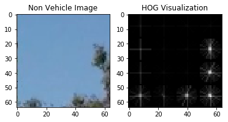

# **Vehicle Detection Project**

## Introduction

A self driving car should be able to detect other vehicle on the road. Detection would mean classifying an object as car, identifying it's shape, position on the road, size of the vehicle, orientation of the vehicle etc.

Using this information self driving car should be able to take action so as to maintain appropriate distance from other vehicles on the roads and avoid collisions.

----

## Project Goals

* Perform a Histogram of Oriented Gradients (HOG) feature extraction on a labeled training set of images and train a classifier Linear SVM classifier
* Optionally, you can also apply a color transform and append binned color features, as well as histograms of color, to your HOG feature vector. 
* Note: for those first two steps don't forget to normalize your features and randomize a selection for training and testing.
* Implement a sliding-window technique and use your trained classifier to search for vehicles in images.
* Run your pipeline on a video stream (start with the test_video.mp4 and later implement on full project_video.mp4) and create a heat map of recurring detections frame by frame to reject outliers and follow detected vehicles.
* Estimate a bounding box for vehicles detected.

---

## Reflection


* ###### Step 1 : Gathering feature to classify an image as vehicle and not a vehicle.

For machine to classify an image as that of vehicle or not a vehicle, it needs to learn the features that can define a car and then should be able to distinguish these features from similar set of features of other objects like road, sky, tree, person, animal etc.

Histogram of Oriented Gradients (HOG) is one of such important feature. To get HOG features for an image, we have used *skimage.feature.hog* which expects orientation, pix_per_cell and cell_per_block as parameters and returns the feature set.

```python
    features = hog(img, orientations=orient, 
                    pixels_per_cell=(pix_per_cell, pix_per_cell),
                    cells_per_block=(cell_per_block, cell_per_block), 
                    transform_sqrt=True, 
                    visualise=vis, feature_vector=feature_vec)
```

I initially started with orientation as 9, pixel_per_cell as 8 and cells_per_block as 2, but over the time I started seeing better classification results when the following parameters were used:

```python
orient = 32  # HOG orientations
pix_per_cell = 16 # HOG pixels per cell
cell_per_block = 2 # HOG cells per block
hog_channel = 'ALL' # Can be 0, 1, 2, or "ALL"
```




For HOG feature, I ended up using `YCrCb` color space as the false positive were less than other color spaces.

The other features used for classification were spatial features and color histograms for the car. 

* ###### Step 2 : Train classifier. 

To train a classifier, training image sets for vehicle and non vehicle was taken from Udacity which included training sets from ([GTI Vehicle Image Database](http://www.gti.ssr.upm.es/data/Vehicle_database.html) and [KITTI](http://www.cvlibs.net/datasets/kitti/)).

All these images were loaded as two different sets of vehicle and non-vehicle. For vehicle there were *8792* images (64, 64, 3) and for non vehicle there were *8968* images (64, 64, 3). As there wasn't a lot of difference between the sets, I continued using the same for training the classifier.

For all the images, HOG features, spatial features and color histogram were extracted and then stacked for both the sets. The stacked features of type float64 were then used for training using *sklearn.svm.LinearSVC* . Before feeding the features to the classifier, the features were normalized as the scale for the extracted features were different. The features were then split into training and test sets. The training set was used for training the classifier while the test set was used to verify the accuracy.

```python
   X_train, X_test, y_train, y_test = train_test_split(
      scaled_X, y, test_size=0.2, random_state=rand_state)
   
   svc = LinearSVC()
   svc.fit(X_train, y_train)
```

Post training the classifier as I was already getting 0.9958 accuracy, I used the same classifier for prediction.

* ###### Step 3 : Sliding window search 

The next step was to use sliding window to search for vehicle within the images. For this I use windows of different size, namely

| Name      | Window size |  Overlapping | Y_start_stop |
|:---------:|:-----------:|:------------:|:------------:|
| tiny      | 48 x 48     | 0.5, 0.5     | 400, 580     |
| small     | 64 x 64     | 0.5, 0.5     | 400, 680     |
| medium    | 128 x 128   | 0.5, 0.5     | 400, 680     |
| large     | 192 x 192   | 0.0, 0.0     | 400, 680     |

For sliding window search the pixels *above 400px (y top) were ignored* and *below 680px (y bottom) were also ignored*. As for *x start, pixels upto 600px were ignored*.

The following shows the sliding windows over the images of different sizes:

Tiny

---


---

Small

---


---

Medium

---


---

Large

---


---

* ###### Step 4 : Classifying the image under the window as vehicle 

For each of the window slides, the image within the window box was then used the extract HOG features, spatial features and color histogram. The extracted features were then normalized and fed to the training classifier to identify the image as vehicle or not.

If the image was predicted as vehicle the window box was appended to a list.

```python

   prediction = svc.predict(test_features)
        
   #if prediction is a car, store the window
   if prediction == 1:
      on_windows.append(window)
```

The resulted in the following:


This list of windows was the then used create a heatmap. To remove false positives the heatmap was standardized and then threshold was applied.

```python

    heatmap_std = heatmap.std(ddof=1)
    if heatmap_std != 0.0:
        heatmap = (heatmap - heatmap.mean())/ heatmap_std

    heatmap = apply_threshold(heatmap, np.max([heatmap.std(), 1]))
```

The heatmap is appended to heatmap history list which maintains the history of last 10 heatmaps. The integrated heatmap history is then averaged and filtered using the same threshold. 

```python

   hmap = sum(heatmap_history)/ len(heatmap_history)
   hmap = apply_threshold(hmap, np.max([hmap.std(), 1]))
           
   labels = label(hmap)
```

This is then passed to *scipy.ndimage.measurements.label()* to identify individual blobs in the heatmap. The bounding boxes are then drawn to cover the area of each blob detected.


---

## Video Implementation


[](http://www.youtube.com/watch?v=6TvMuC83ui8)


---

## Discussion

During the development it took me a lot of time to get the HOG parameters that would work for the project. I tried different combinations for orientation and pixel_per_cell, and eventually ending up with *32, 16* respectively. Experimenting with different color spaces I finally stuck to *YCrCb* as I was getting lower false positives and the detection of vehicle had also improved.

For sliding window I tried multiple combinations. With smaller window sizes I was getting more false positives and with larger window sizes I was not able to detect any vehicle. After some time, I used different combinations of window sizes, starting from *48 to 192* with different overlaps. This did improve the results, but I had some false positives. To reduce the false positive I ended up defining the region with *y_start_stop and x_start_stop* parameters.

Cause of this region of interest the current pipeline will not work of vehicle on left lanes.